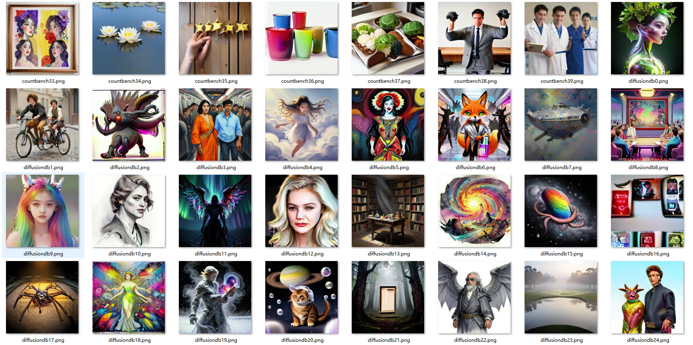

<div align="center">

# LingXi-Image-MoE: From Alternating to Full-Layer<br>A Comparative Study of Mixture-of-Experts Architectures for Text-to-Image Diffusion Models<br><small>从交替到全层：混合专家架构在文生图扩散模型中的对比研究</small>

<a href="https://arxiv.org/abs/xxxx.xxxxx" target="_blank"></a>
<a href="https://huggingface.co/shyai/LingXi-Image-MoE" target="_blank"></a>
<a href="https://github.com/Lingxi-Qihang/LingXi-Image-MoE" target="_blank"></a>
<a href="https://modelscope.cn/models/haohanxingcheng/LingXi-Image-MoE" target="_blank"></a>

🌐 [中文文档 (Chinese README)](./README_zh.md)

</div>

---
The "second highest spatial relationship in the world" mentioned in this article is an objective indicator based on the DPG Bench public evaluation benchmark, and is not self proclaimed or exaggerated by me. DPG Bench is one of the industry recognized standards for evaluating cultural and biological images, and the scores of all comparison models are obtained from official papers or public rankings. My 1.68B model has been fully open sourced, and any researcher can download weights, reproduce evaluations, and validate this result. Technology can be discussed, and scores can withstand scrutiny.
---

---

# 🔥 News
- 🧠 **1.68B 模型权重**：[GitHub](https://github.com/Lingxi-Qihang/LingXi-Image-MoE-1.68B-A0.56M) | [ModelScope](https://modelscope.cn/models/haohanxingcheng/LingXi-Image-MoE/tree/master/LingXi-Image-MoE-1.68B-A0.56M)
- 📦 **125万步 checkpoint**：[ModelScope](https://modelscope.cn/models/haohanxingcheng/LingXi-Image-MoE/tree/master/ckpt_step_1250000.pth)
- [2026-07-27] **ProMoE‑L (1.68B)** joint training completed. Paper "Temporal Patterns of Capability Emergence: A Fine-Grained Analysis of Training Dynamics in a 1.68B Full-Layer MoE Text-to-Image Model" released. 
- [2026-07-13] Paper "From Alternating to Full-Layer: A Comparative Study of Mixture-of-Experts Architectures for Text-to-Image Diffusion Models" released on arXiv.
- [2026-07-13] Model weights available on [HuggingFace](https://huggingface.co/shyai/LingXi-Image-MoE) and [ModelScope](https://modelscope.cn/models/haohanxingcheng/LingXi-Image-MoE).
- [2026-07-12] Full code open-sourced on [GitHub](https://github.com/Lingxi-Qihang/LingXi-Image-MoE).

> For the 0.47B version training and inference, see [LingXi-Image-MoE main repo](https://github.com/Lingxi-Qihang/LingXi-Image-MoE).

---

## About This Paper

**"Temporal Patterns of Capability Emergence: A Fine-Grained Analysis of Training Dynamics in a 1.68B Full-Layer MoE Text-to-Image Model"**

Large-scale diffusion model training is often treated as a "black box." Based on a **1.68B parameter full-layer MoE text-to-image model**, this paper conducts fine-grained DPG-Bench evaluations every 50K steps from 300K to 1.2M steps, systematically recording the dynamic growth curves of five core capabilities for the first time, revealing three key patterns:

1. **Early Stabilization**: Spatial relation ability stabilizes before 300K steps, remaining at 92–94
2. **Mid-term Climbing**: Entity completeness and texture quality steadily improve from 300K to 1.2M steps, driving overall score from 71 to 79
3. **Late Awakening**: Counting ability suddenly surges at 550K steps, marking the sprint window for high-level capabilities

In terms of efficiency, this model achieves a **79.57** DPG-Bench score with only **300 GPU hours** (single A100, ~$350 cloud rental), surpassing 2.6B SDXL.

---

## Main Results

### DPG-Bench Growth Curve (300K–1.2M Steps)

| Steps | Relation | Entity | Attribute | Global | Other | **Overall** |
|-------|----------|--------|-----------|--------|-------|------------|
| 300K | 92.69 | 82.13 | 84.24 | 79.14 | 57.20 | **71.09** |
| 500K | 92.54 | 84.83 | 87.02 | 82.21 | 62.00 | **75.27** |
| 750K | 93.63 | 86.53 | 87.77 | 80.67 | 74.40 | **77.85** |
| 1.0M | 94.17 | 87.73 | 88.45 | 79.75 | 70.40 | **79.57** |
| 1.2M | 94.48 | 87.29 | 88.23 | 81.29 | 70.40 | **79.00** |

Complete training logs, routing analysis, and DPG-Bench evaluation data are in the [`logs/`](#file-structure) directory.


*DPG-Bench L1 metrics and overall score vs. training steps (300K–1.2M). Relation stabilizes early, Entity/Attribute climb steadily, Other awakens late.*


*DPG-Bench samples from the 1.25M-step checkpoint*

### Comparison with Industry Models

| Model | Params | Training Cost | Overall |
|-------|--------|--------------|---------|
| SD v1.5 | 0.86B | — | 63.18 |
| SDXL | 2.6B | — | 74.65 |
| **LingXi-Image-MoE (1.68B)** | **1.68B** | **300 GPU hrs** | **79.57** |
| PixArt-Σ | 0.6B | — | 80.54 |
| FLUX.1 Dev | 12B | — | 83.84 |

### Training Cost & Data Efficiency

| Model | GPU Hours | Data | Score | Efficiency (pts/GPU hr) |
|-------|-----------|------|-------|------------------------|
| Z-Image | 314,000 H800 | N/A | 88.14 | 0.00028 |
| SeFi-Image 5B | 125,000 A800 | 450M | 87.27 | 0.00070 |
| **LingXi-Image-MoE** | **300 A100** | **2.66M** | **79.57** | **0.265** |

> Efficiency is **940× higher** than Z-Image and **380× higher** than SeFi-Image.

---

## Cross-Resolution Generalization

2D RoPE continuous position encoding allows a single weight to inference at any resolution. Below are comparisons of the 1.25M-step checkpoint at 256 base, 512 zero-shot, and 1.5M-step 512 fine-tuned results:

| 256×256 (Base, 1.25M) | 512×512 (Zero-shot, 1.25M) | 512×512 (Fine-tuned, 1.5M) |
|:---:|:---:|:---:|
|  |  |  |
|  |  |  |
|  |  |  |
|  |  |  |

### DPG-Bench: Zero-shot vs 512 Fine-tuned

| Config | Global | Entity | Attribute | Relation | Other | **Overall** |
|--------|--------|--------|-----------|----------|-------|------------|
| 256 (1.25M, base) | 80.67 | 87.40 | 88.25 | 94.24 | 70.39 | **79.07** |
| 256→512 (zero-shot) | 68.40 | 70.44 | 71.59 | 85.96 | 39.20 | **55.63** |
| 512 FT 50K steps | 76.68 | 87.10 | 86.94 | 93.98 | 71.60 | **77.74** |
| 512 FT 100K steps | 77.91 | 87.35 | 87.06 | 93.82 | 74.40 | **78.53** |
| 512 FT 150K steps | 77.91 | 87.29 | 87.06 | 93.16 | 71.20 | **78.02** |
| 512 FT 200K steps | 77.91 | 87.51 | 87.16 | 93.43 | 74.80 | **78.53** |
| 512 FT 250K steps | 77.61 | 87.24 | 87.63 | 93.74 | 77.20 | **78.25** |

**Key Conclusions:**

1. **Full-layer MoE has good cross-resolution generalization potential.** Zero-shot Relation still achieves 85.96, proving 2D RoPE effectively transfers macro spatial reasoning.
2. **High-frequency details degrade with resolution.** Entity/Attribute drop from 87–88 to 70–71, manifesting as "water ripple" artifacts in zero-shot inference.
3. **Short fine-tuning quickly recovers performance.** Only 50K steps of 512 fine-tuning restores overall score to 77.74 (base 79.07), and after 100K steps, Other (counting/text) surpasses the base.

---

## Core Findings

### Three-Stage Capability Emergence Hypothesis

1. **Stage I: Early Stabilization (0–300K steps)** — Spatial relation converges to 92+ and barely changes thereafter
2. **Stage II: Mid-term Climbing (300K–800K steps)** — Entity completeness and texture quality drive overall score improvement
3. **Stage III: Late Sprint (800K+ steps)** — Higher-order abilities like counting surge after basic capabilities saturate

### Global Pseudo-Saturation and Text Encoder Bottleneck

Global metric oscillates in the 79–82 range. Comparing with the 0.47B model that also uses T5-base, this bottleneck stems from the **lightweight text encoder (T5-base, 220M) semantic expression ceiling**, not the full-layer MoE architecture. Upgrading to T5-XXL or Qwen-VL is key.

### U-Shaped Layer Specialization

Shallow layers (0–2) and deep layers (9–11) show significantly higher routing differentiation (CV) than middle layers (3–8). This pattern is reproduced on both 0.47B and 1.68B models, confirming it as a structural feature of visual diffusion MoE.

---

## Core Features

### ProMoE Two-Stage Routing
- **Conditional Routing**: Splits tokens into conditional (not dropped in CFG) and unconditional (CFG null-text) groups
- **Prototype Routing**: Assigns experts via cosine similarity between learnable prototype vectors and tokens; Top-K activation
- **Unconditional Expert Relocation**: Expert 12 dedicated to CFG null-text samples

### MM-DiT Text-Image Fusion
- Text sequence concatenated with image tokens along the sequence dimension; self-attention processes both simultaneously
- Text global vector injected via AdaLN modulation

### Dynamic Resolution (2D Continuous RoPE)
- Image tokens: 2D RoPE, coordinates normalized to [0,1]
- Text tokens: 1D RoPE
- Single weight supports arbitrary resolution (256/512/768/1024+), no interpolation or fine-tuning
- Verified 256→512 zero-shot cross-resolution generalization (see [Cross-Resolution Generalization](#cross-resolution-generalization))

### Unified Symbiosis Framework
- T2I: source latent is zero black image
- Image Editing: source latent is the original encoding of the target image

---

## Model Architecture

### ProMoE-TC-L Configuration (1.68B)

| Parameter | Value |
|-----------|-------|
| Hidden size | 1024 |
| Transformer layers | 24 (all MoE) |
| Attention heads | 16 |
| Routed experts | 12/layer |
| Unconditional expert | 1/layer |
| Shared expert | 1/layer |
| Top-K activation | 2 |
| MoE intermediate size | 2048 |
| Total parameters | **1.67B** |
| Active parameters (per token) | **559.7M** |
| Model size (float32) | 6,362 MB |

**Parameter Breakdown (total / active per token):**

| Component | Total | Active |
|-----------|-------|--------|
| Attention | 251.9M | 251.9M |
| MoE experts | 1,309.6M | 201.5M |
| Shared expert | 100.7M | 100.7M |
| Embedding | 3.2M | 3.2M |
| Router | 0.3M | 0.3M |
| Final | 2.1M | 2.1M |

**Activation memory estimation (batch=1, float32):** 256px: 2.4GB | 512px: 4.8GB | 1024px: 14.3GB

> All 24 layers use MoE (code overrides interleave with `use_moe_flag = [True] * depth`).

---

## Environment Setup

```bash
conda create -n promoe python=3.10 -y
conda activate promoe
pip install -r requirements.txt
```

---

## Data Preprocessing

We use T5-base for text encoding and sd-vae-ft-mse for image encoding, caching preprocessed features to accelerate training.

### 1. Download Data

```bash
bash preprocess/download.sh
```

Downloads `train-000000.tar` ~ `train-001310.tar` in parallel, saved to `/data/coding/` by default.

### 2. Extract Data

```bash
python preprocess/extracted_data.py
```

Extracted structure:
```
curated_extracted_data/
└── synthetic_original_prompt_square_resolution/
    ├── 000000000.jpg / 000000000.txt
    ├── 000000001.jpg / 000000001.txt
    └── ...
```

### 3. Extract Features

```bash
python preprocess/preprocess_ma-xu-fine-t2i.py \
  --image_root /path/to/curated_extracted_data \
  --output_dir /path/to/preprocessed_output \
  --t5_path /path/to/t5-base \
  --vae_path /path/to/sd-vae-ft-mse \
  --image_size 512 \
  --batch_size 8
```

Output structure:
```
preprocessed_output/
├── latents/
│   ├── target_512/            # 512-res latents
│   └── target/                # 256-res latents
└── t5_text_features/
    ├── 000000000_seq.npy      # T5 sequence features (512, 768)
    ├── 000000000_mask.npy     # Attention mask (512,)
    └── ...
```

### 4. Configure Training

```yaml
latent_root: "/path/to/preprocessed_output/latents"
text_root: "/path/to/preprocessed_output/t5_text_features"
```

---

## Dataset Composition

Training uses ~**2.66M** image-text pairs, mixed at ~**8.5:1.5** ratio (T2I : Editing):

| Subset | Size | Description |
|--------|------|-------------|
| Fine-T2I enhanced | ~1.54M | Long text, complex details |
| Fine-T2I original | ~440K | Short text generalization (sampled from 1.3M) |
| Fine-T2I curated | ~168K | Real photography, eliminates "AI plastic feel" |
| Face/Text enhancement | ~192K | Improves faces and text rendering |
| Image editing data | ~280K | Open-source editing dataset |
| **Total** | **~2.66M** | |

---

## Training

### Two-Step Joint Training

Use the `train_joint.sh` script with default config `configs/joint.yaml` (256 resolution).

Complete training logs, routing analysis, and DPG-Bench evaluation data in [`logs/`](#file-structure).

**Step 1: Base training (200K steps)**

```bash
bash train_joint.sh
```

**Step 2: Resume from checkpoint (2M steps)**

```bash
bash train_joint.sh --ckpt ProMoE_L/ProMoE_TC_L/joint_d4HRU/checkpoints/ckpt_step_1250000.pth --steps 2000000
```

**512 resolution training:**

```bash
bash train_joint.sh --size 512 --ckpt path/to/checkpoint.pth --steps 2000000
```

### Custom Parameters

```bash
# Multi-stage (variable learning rate/steps)
bash train_joint.sh --lr 1e-4 5e-5 --steps 150000 50000

# Full options
bash train_joint.sh --ckpt path --accum 4 --batch_size 32 --img_size 512 --gpu 0
```

### Training Configs

| Parameter | 256 Resolution | 512 Resolution |
|-----------|---------------|---------------|
| `image_size` | 256 | 512 |
| `total_train_batch_size` | 64 | 16 |
| `lr` | 1e-4 | 1e-4 |
| `latent_root` | `.../latents` | `.../latents_512` |
| Config file | `joint.yaml` | `joint_512.yaml` |

### Training Cost

- Hardware: Single A100 80GB
- Time: ~12 days (to 1.2M steps)
- Cost: ~$350 cloud rental
- All DPG-Bench evaluations: NVIDIA RTX 4080 (local)

> Loss Spike fixes from the 0.47B model (CosineAnnealingLR, VAE mean handling, data integrity checks, optimizer state reset) are all migrated. The entire 1.68B training process shows smooth loss descent from ~1.6 to 0.4–0.5, with **no spikes**.

---

## Inference

Three inference methods. `inference.py` and `sample.py` load `.pth` weights directly. `infer_diffuser.py` uses Diffusers format; first convert checkpoint with `pt2diffuser.py`:

```bash
python pt2diffuser.py --config configs/joint.yaml \
    --ckpt path/to/ckpt_step_1250000.pth \
    --save_dir ./pro_moe_diffusers \
    --vae_path /path/to/sd-vae-ft-mse \
    --t5_path /path/to/t5-base \
    --image_size 256
```

| Parameter | Description |
|-----------|-------------|
| `--config` | YAML config (specifies model architecture) |
| `--ckpt` | Trained checkpoint `.pth` file |
| `--save_dir` | Output directory for Diffusers format |
| `--vae_path` | VAE model path |
| `--t5_path` | T5 text encoder path |
| `--image_size` | Training image size (default 256) |

### 1. inference.py (Lightweight)

```bash
# Single prompt
python inference.py \
  --config configs/joint.yaml \
  --ckpt path/to/checkpoint.pth \
  --prompt "A cat holds a poster" \
  --output outputs \
  --vae_path /path/to/sd-vae-ft-mse \
  --t5_path /path/to/t5-base \
  --guide_scale 4.0 \
  --seed 42

# Batch inference
python inference.py \
  --config configs/joint.yaml \
  --ckpt path/to/checkpoint.pth \
  --prompt_dir /path/to/prompt/dir \
  --output outputs
```

| Parameter | Default | Description |
|-----------|---------|-------------|
| `--config` | Required | YAML config |
| `--ckpt` | Required | Model checkpoint path |
| `--prompt` | — | Single text prompt |
| `--prompt_dir` | — | Directory of .txt prompt files |
| `--output` | outputs | Output directory |
| `--image_size` | 256 | Generated image size |
| `--guide_scale` | 4.0 | CFG guidance scale |
| `--sample_steps` | 50 | Sampling steps |
| `--seed` | 0 | Random seed |
| `--vae_path` | — | VAE model path |
| `--t5_path` | — | T5 model path |

### 2. sample.py (Sampling & Evaluation)

Supports multi-checkpoint comparison, multi-CFG scales, and image editing:

```bash
python sample.py \
  --config configs/joint.yaml \
  --step_list_for_sample 1000000,1200000 \
  --guide_scale_list 4.0,5.0,7.0 \
  --sample_prompts "a cat sitting on a chair" \
  --source_image_path /path/to/source.jpg
```

| Parameter | Description |
|-----------|-------------|
| `--step_list_for_sample` | Checkpoint steps (comma-separated) |
| `--guide_scale_list` | CFG guidance scales |
| `--num_fid_samples` | Samples per step |
| `--source_image_path` | Source image path (editing task) |
| `--sample_prompts` | Direct prompt input |
| `--prompt_file` | Prompt file (one per line) |

### 3. infer_diffuser.py (Diffusers Format)

```bash
# Single prompt
python infer_diffuser.py \
  --model_dir ./pro_moe_diffusers \
  --prompt "A cat" \
  --output ./outputs

# Batch inference
python infer_diffuser.py \
  --model_dir ./pro_moe_diffusers \
  --prompt_dir ./prompts \
  --output ./outputs \
  --guide_scale 4.0 \
  --steps 50

# Parameter analysis only
python infer_diffuser.py --model_dir ./pro_moe_diffusers --analyze
```

| Parameter | Default | Description |
|-----------|---------|-------------|
| `--model_dir` | Required | Converted diffusers model directory |
| `--prompt` | — | Single text prompt |
| `--prompt_dir` | — | Batch prompt directory |
| `--output` | outputs | Output directory |
| `--guide_scale` | 4.0 | CFG guidance scale |
| `--steps` | 50 | Sampling steps |
| `--seed` | 0 | Random seed |
| `--analyze` | — | Parameter analysis only |

---

## Training Stability

Loss Spike fixes from the 0.47B model, all migrated:

| Issue | Root Cause | Fix |
|-------|-----------|-----|
| Late oscillation | Fixed lr | CosineAnnealingLR |
| Numerical noise | VAE variance sampling | Use mean directly |
| Gradient explosion | Corrupted NaN/Inf files | Dataset-level filtering |
| Post-recovery collapse | Momentum contaminated by abnormal gradients | Reset optimizer state |
| Occasional OOM | Loss threshold too low | Raised threshold to 1.5 |

Entire 1.68B training: smooth loss descent, **no Loss Spike**.

---

## Known Limitations

- **Face details**: Limited by 4-channel VAE and T5-base capacity
- **Counting ability**: DPG-Bench count ~68.5, needs dedicated data
- **Global metric**: T5-base semantic ceiling, oscillates 79–82
- **512 resolution**: Zero-shot has high-frequency artifacts, needs fine-tuning
- **Memory**: 1.68B full-layer MoE runs on RTX 4080

---

## Future Work

1. **Upgrade text encoder**: T5-XXL or Qwen-VL to break Global bottleneck
2. **Data expansion**: Add counting-specific data
3. **Curriculum learning**: 256→512 high-res training
4. **Upgrade VAE**: 16-channel VAE for detail breakthrough

Expected to reach **85+** overall score at 1.5–2M steps (including high-res phase), with total GPU consumption under 2,000 hours.

---

## File Structure

```
├── configs/
│   ├── joint.yaml               # Joint training config (256)
│   ├── joint_512.yaml           # Joint training config (512)
│   ├── 004_ProMoE_L.yaml        # ProMoE-L reference config
│   └── ...
├── train_joint.sh               # Joint training pipeline
├── train_GradientAccumulationSteps.py  # Training script
├── models/
│   ├── modules.py               # Shared modules (Attention, RoPE, MoE)
│   └── models_ProMoE_TC.py     # ProMoE text-conditional model
├── preprocess/                  # Data preprocessing scripts
├── inference.py                 # Lightweight inference
├── sample.py                    # Sampling & evaluation
├── infer_diffuser.py            # Diffusers format inference
├── pt2diffuser.py               # Model format converter
├── promoe_pipeline.py           # Diffusers pipeline components
├── logs/                        # Training logs & visualizations
│   ├── joint_phase1.log         # Full joint training log (0–1.45M steps)
│   ├── moe_routing.log          # Routing expert utilization log (every 100 steps)
│   ├── dpg-bench.txt            # Complete DPG-Bench evaluation records
│   ├── dpg_bench_L1.png         # L1 metric growth curves
│   ├── dpg_bench_L2.png         # L2 sub-metric growth curves
│   ├── loss_comparison.png      # Training loss curve
│   ├── plot_dpg_bench.py        # DPG-Bench visualization script
│   ├── plot_loss.py             # Loss curve plotting script
│   └── analyze_routing.py       # Routing behavior analysis script
└── evaluation/                  # Evaluation scripts
```

---

## Citation

```bibtex
@misc{sha2026fullayer,
  title={From Alternating to Full-Layer: A Comparative Study of Mixture-of-Experts Architectures for Text-to-Image Diffusion Models},
  author={Haiying Sha},
  year={2026},
  note={LingXi-Image-MoE-1.0},
  url={https://github.com/Lingxi-Qihang/LingXi-Image-MoE}
}

@article{sha2026emergence,
  title={Temporal Patterns of Capability Emergence: A Fine-Grained Analysis of Training Dynamics in a 1.68B Full-Layer MoE Text-to-Image Mode},
  author={Haiying Sha},
  year={2026},
  note={LingXi-Image-MoE-1.68B},
  url={https://github.com/Lingxi-Qihang/LingXi-Image-MoE-1.68B-A0.56M}
}
```

---

## References

[1] DiT: Scalable Diffusion Models with Transformers. ICCV 2023.  
[2] ProMoE: Routing Matters in MoE. ICLR 2026.  
[3] FiT: Flexible Vision Transformer for Diffusion Model. NeurIPS 2024.  
[4] DPG-Bench: A Dense Prompt Generation Benchmark for Text-to-Image Models. ICLR 2024.  
[5] Scaling Rectified Flow Transformers for High-Resolution Image Synthesis. ICML 2024.  
[6] Sparse MoE Routing in Visual Diffusion Transformers: Diagnosis and Roadmap. arXiv:2605.19378.
